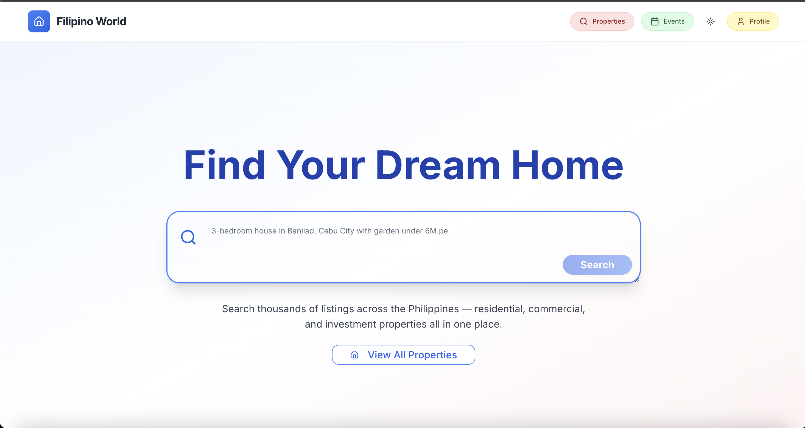

# Filipino World by DEBMAC



## About The Project

Filipino World is an all-in-one real estate platform focused on the Philippine property market. Our application connects property seekers with their dream homes through an intuitive interface powered by AI technology.

## Unique Value Proposition

- **Natural Language Property Search**: Find properties using conversational queries like "3-bedroom house in Banilad, Cebu City with garden under 6M pesos"
- **Comprehensive Listings**: Access thousands of properties across the Philippines, from luxurious condos to affordable homes
- **AI-Powered Recommendations**: Get personalized property suggestions based on your preferences and requirements
- **Interactive Maps**: Explore properties geographically with our integrated map feature
- **AI Property Appraisal**: Get instant property valuations with detailed market analysis, rental income potential, and proximity data
- **Local Events Discovery**: Explore festivals, cultural events, and activities happening in different locations across the Philippines


## Technologies Used

### Frontend
- **Next.js** - Full-stack React framework for server-side rendering and static site generation
- **Tailwind CSS** - Utility-first CSS framework for rapid UI development
- **Framer Motion** - Animation library for React

### Backend
- **Next.js API Routes** - Serverless backend functionality
- **MongoDB** - NoSQL database for storing property and user data

### AI & Maps Integration
- **Vertex AI** - Google's machine learning platform used for web scraping and gathering real-time data about properties and events
- **OpenAI** - For data processing, natural language understanding, and generating personalized responses
- **Mapbox** - Interactive mapping platform for geographical property visualization

## Getting Started

### Prerequisites
- Node.js 18+ 
- npm or yarn

### Installation
1. Clone the repository
   ```
   git clone https://github.com/yourusername/filipino-world.git
   ```

2. Install dependencies
   ```
   npm install
   ```

3. Set up environment variables
   Create a `.env.local` file in the root directory with the following variables:
   ```
   NEXT_PUBLIC_MAPBOX_TOKEN=your_mapbox_token
   MONGODB_URI=your_mongodb_connection_string
   OPENAI_API_KEY=your_openai_api_key
   GOOGLE_API_KEY=your_google_api_key
   ```

4. Run the development server
   ```
   npm run dev
   ```

5. Open [http://localhost:3000](http://localhost:3000) in your browser


